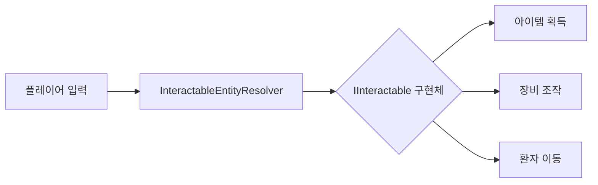
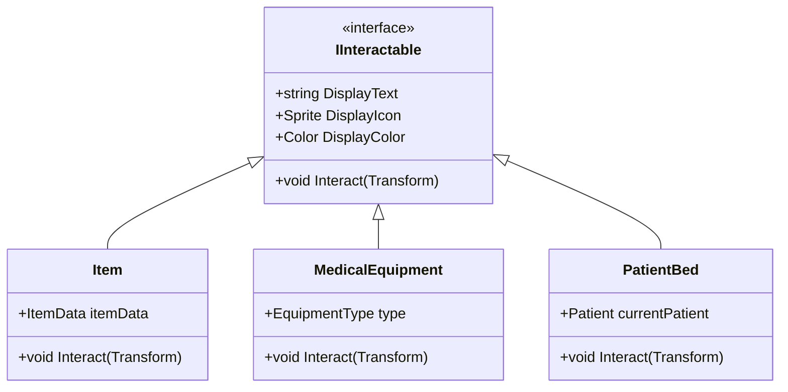

# Interactable Entity System

상호작용 가능 엔티티(Interactable Entity)는 인게임에서 플레이어가 상호작용할 수 있는 모든 객체를 나타냅니다. 대표적으로는 세계 상에 떨어진 아이템(Grounded Item)이 있고, 이동 가능한 환자 베드, 큰 의료 장비 등의 상호작용 가능 개체도 포함됩니다.   

모든 상호작용 가능 엔티티는 `IInteractable` 인터페이스를 구현하여야 합니다. 이 인터페이스는 이후에 플레이어에게 상호작용 가능 물체를 UI로서 표시할 때, 플레이어가 해당 물체와 상호작용을 시도할 때의 처리를 정의하도록 되어있습니다.  

이 인터페이스는 아이템 정보가 아니므로, 만약 Grounded Item를 구현하고자 한다면, 아이템 데이터를 설명하는 다른 기술자와는 별개로 이 인터페이스를 구현해야 합니다.

## 시스템 개요
상호작용 가능 엔티티 시스템은 게임 내에서 플레이어와 상호작용 가능한 모든 객체를 관리하는 통합 프레임워크입니다. 이 시스템은 다음을 포함합니다:



## 핵심 컴포넌트

### 1. IInteractable 인터페이스
모든 상호작용 객체는 반드시 이 인터페이스를 구현해야 합니다:

```csharp
public interface IInteractable {
    string DisplayText { get; }  // 상호작용 UI에 표시될 텍스트
    Sprite DisplayIcon { get; }  // 64x64 픽셀 아이콘
    Color DisplayColor { get; }  // 강조 색상 (기본값: Color.white)
    void Interact(Transform interactor);  // 상호작용 로직
}
```

### 2. InteractableEntityResolver
상호작용 요청을 처리하는 핵심 컴포넌트:

```csharp
[DisallowMultipleComponent]
public class InteractableEntityResolver : MonoBehaviour {
    [SerializeField] private List<MonoBehaviour> handlerSources; // 인스펙터에서 할당
    private readonly List<IInteractable> handlers = new List<IInteractable>();

    void Awake() {
        handlers.Clear();
        foreach (var source in handlerSources) {
            if (source is IInteractable handler) {
                handlers.Add(handler);
            }
        }
    }

    public void Resolve(IInteractable interactable, Transform interactor) {
        foreach (var handler in handlers) {
            handler.Interact(interactor);
            return; // 첫 번째 핸들러에서 처리 후 종료
        }
        Debug.LogWarning($"No handler found for {interactable.DisplayText}");
    }
}
```

## 구현 가이드

### 기본 구현 예제 (떨어진 아이템)
```csharp
public class Item : MonoBehaviour, IInteractable {
    [SerializeField] private ItemData itemData;
    
    public string DisplayText => itemData.displayName;
    public Sprite DisplayIcon => itemData.ItemTexture;
    public Color DisplayColor => Color.white;

    public void Interact(Transform interactor) {
        if (interactor.TryGetComponent(out PlayerInventory inventory)) {
            if (inventory.AddItem(itemData)) {
                Destroy(gameObject); // 아이템 획득 후 제거
            }
        }
    }
}
```

### 환자 이동 베드 구현 예제
```csharp
public class PatientBed : MonoBehaviour, IInteractable {
    public string DisplayText => "환자 이동";
    public Sprite DisplayIcon => bedIcon;
    public Color DisplayColor => Color.green;
    
    public void Interact(Transform interactor) {
        if (currentPatient != null) {
            currentPatient.TransferTo(interactor.position);
            Debug.Log($"{currentPatient.Name} 이동 시작");
        }
    }
}
```

## 시스템 동작 흐름
1. 플레이어가 상호작용 키 입력 (기본 E 키)
2. `PlayerInteractiveDetector`가 반경 2m 내 객체 검출
3. 가장 가까운 `IInteractable` 구현체 선택
4. `InteractableEntityResolver.Resolve()` 호출
5. 등록된 핸들러들이 순차적으로 처리 시도
6. 첫 번째 성공한 핸들러에서 처리 완료

## 모범 사례

### 성능 최적화
- `Interact()` 메서드는 1프레임 내 완료 보장
- 무거운 작업은 `Coroutine`으로 분리
- 객체 풀링 구현 권장 (빈번한 생성/삭제 시)



## 문제 해결 가이드

### 상호작용 UI 미표시
1. 객체에 `IInteractable` 구현 확인
2. `PlayerInteractiveDetector` 검색 반경 확인 (기본 2m)
3. 객체 Collider의 `IsTrigger` 상태 확인

### 상호작용 미동작
```csharp
// 디버깅 코드 예제
void OnInteractFailed(IInteractable interactable) {
    Debug.LogWarning($"상호작용 실패: {interactable.DisplayText}");
    Debug.Break(); // 에디터에서 실행 일시정지
}
```

### 핸들러 등록 문제
인스펙터에서 핸들러 올바르게 할당:
1. 게임오브젝트 선택
2. `InteractableEntityResolver` 컴포넌트 찾기
3. Handler Sources 리스트에 구현체 드래그 앤 드롭

## 고급 기능

### 다단계 상호작용
```csharp
public class MultiStageInteractable : IInteractable {
    private int interactionStage;
    
    public void Interact(Transform interactor) {
        switch (interactionStage++) {
            case 0: /* 1단계 동작 */ break;
            case 1: /* 2단계 동작 */ break;
        }
    }
}
```

### 조건부 상호작용
```csharp
public class ConditionalInteractable : IInteractable {
    public bool IsInteractable => requiredItem.InInventory;
    
    public void Interact(Transform interactor) {
        if (!IsInteractable) return;
        // 상호작용 로직
    }
}
```

### 상호작용 우선순위 시스템
```csharp
// 핸들러 정렬 예제
handlers = handlers
    .OrderByDescending(h => h.Priority)
    .ThenBy(h => h.DistanceToPlayer)
    .ToList();
```
