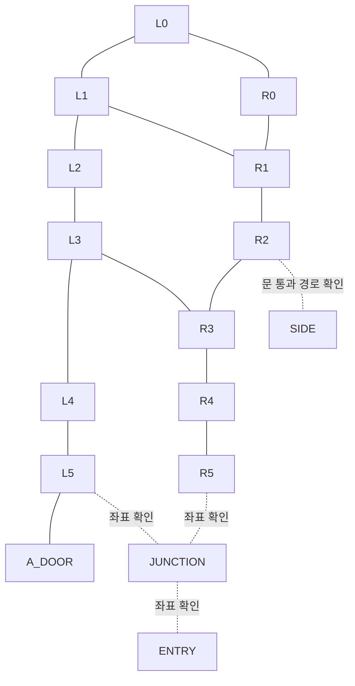

# OverworldScene 이동 지점과 시나리오 엔티티 위치

## 좌표와 근거

2026-09-09 작업 트리를 기준으로 작성했다. 이동 지점은 사용자가 제공한 `IMG_8207.jpeg`의 손그림을 옮겼으며, 장비와 스폰 위치는 저장소의 씬·프리팹·시나리오 그래프에서 확인했다. 손그림은 이동 참고 자료이며, 이 문서의 경로를 실제 플레이로 검증한 것은 아니다.

- 그림의 `(x, z)`는 Unity 월드 평면 좌표다. 실행 예제의 `[x, y, z]`에서 `y=0`은 평지 이동 목표의 기준 높이다. 장비의 설치 높이를 플레이어의 목표 높이로 사용하지 않는다.
- 그림은 **왼쪽이 +X, 오른쪽이 -X, 위쪽이 -Z, 아래쪽이 +Z**다. 실제 방위와 혼동하지 않도록 아래에서도 그림 기준으로 설명한다.
- 검은 점은 이동 참고점, 빨간 실선은 벽, 양끝 화살표가 달린 빨간 선은 문의 폭, 사각형 안 화살표는 침대 스냅 위치와 방향이다. 문 폭의 끝점은 이동 목표가 아니다.
- 아래 그래프의 간선은 손그림의 연결을 옮긴 경로 후보다. 벽·침대·카트·다른 플레이어의 충돌체를 피할 수 있는지는 실행 중에 확인한다. 거리만 가까운 두 노드를 임의로 직선 연결하지 않는다.

## 손그림의 이동 그래프

### 노드와 벡터

`L`은 그림 왼쪽 통로, `R`은 오른쪽 통로다. `L4`와 `R4`는 서로 다른 Z값을 유지한다.

| ID | 평면 좌표 `(x, z)` | 용도 |
|---|---|---|
| L0 | (-68, -32) | 위쪽 왼쪽 모서리 |
| L1 | (-68, -28) | 위쪽 왼쪽 통로 |
| L2 | (-68, -26.25) | 왼쪽 통로의 중간 참고점 |
| L3 | (-68, -20.95) | 중앙 횡단 통로의 왼쪽 끝 |
| L4 | (-68, -15.5) | 아래쪽 왼쪽 통로 |
| L5 | (-68, -9.65) | 아래쪽 왼쪽 모서리 |
| R0 | (-76.3, -32) | 위쪽 오른쪽 모서리 |
| R1 | (-76.3, -28) | 위쪽 오른쪽 통로 |
| R2 | (-76.3, -22.5) | 오른쪽 문 앞 |
| R3 | (-76.3, -20.95) | 중앙 횡단 통로의 오른쪽 끝 |
| R4 | (-76.3, -13.8) | 아래쪽 오른쪽 통로 |
| R5 | (-76.3, -9.65) | 아래쪽 오른쪽 모서리; Z는 반대편 표기와 수평선을 기준으로 읽음 |
| A_DOOR | (-66.6, -9.65) | 왼쪽 아래 방의 문 앞 |
| SIDE | (-80, -18.3) | R2의 문을 지난 쪽에 표시된 목적지 |
| ENTRY | (-72.69, -4.2) | 그림 맨 아래 문의 중심 |
| JUNCTION | (-72.69, -4.2) | L5·R5와 ENTRY 사이의 분기점 |


### ASCII 배치도

점 사이의 `--`, `|`, `/`, `\`는 경로 후보이고 `###`는 벽이다. 도식은 비례도가 아니며, 좌표는 위 표를 따른다. `?`가 붙은 연결은 좌표 또는 통과 경로를 더 확인해야 한다.

```text
            +X <---                         ---> -X
                                 -Z
                                  ^
             L0 o-------------------------------o R0
                |       #################       |
             L1 o                               o R1
                |       #               #       |
             L2 o       #               #       |
                |       #               #       o R2 --?door?--> SIDE
  bed (-64,-23) v       #               #       |
             L3 o-------------------------------o R3
  bed (-64,-19.45) ^    #               #       |
  ############  |       #               #       |
  bed (-64,-17) v       #               #       |
             L4 o       #               #       o R4
  bed (-64,~ -13) ^     #               #       |
  ############  |       #################       |
 A room --?door?-o-------o L5                    o R5
             A_DOOR       \                     /
                           \--- JUNCTION -----/
                                   |
                                   ?
                         |<------ ENTRY ------>|
                          -71.72          -73.65
                                  v
                                 +Z
```

왼쪽 병상 쪽의 가로 벽 두 개는 서로 다른 구역을 나눈다. 벽을 사이에 둔 병상으로는 병상 좌표를 향해 대각선으로 이동하지 말고, 해당 구역의 통로를 통해 접근한다. 가운데 큰 구조물은 위·아래 외곽과 중앙 횡단 통로를 따라 우회한다.

### 그래프와 배열



`L1–R1`은 손그림의 수평 연결선에 근거한 후보다. 실제 통과 여부를 확인하기 전에는 상단 우회 `L1→L0→R0→R1`을 우선 고려한다. `L5–R5`의 직선 연결은 아래 구조물의 벽 때문에 추가하지 않았다.

다음 JSON은 문서용 자료다. `candidateEdges`는 양방향이며, 경로 탐색 시 필요하면 XZ 평면의 유클리드 거리를 가중치로 사용한다. `conditionalEdges`는 일반 경로 탐색에서 제외하고 현장에서 별도로 확인한다.

```json
{
  "coordinateOrder": ["x", "y", "z"],
  "points": {
    "L0": [-68, 0, -32], "L1": [-68, 0, -28],
    "L2": [-68, 0, -26.25], "L3": [-68, 0, -20.95],
    "L4": [-68, 0, -15.5], "L5": [-68, 0, -9.65],
    "R0": [-76.3, 0, -32], "R1": [-76.3, 0, -28],
    "R2": [-76.3, 0, -22.5], "R3": [-76.3, 0, -20.95],
    "R4": [-76.3, 0, -13.8], "R5": [-76.3, 0, -9.65],
    "A_DOOR": [-66.6, 0, -9.65], "SIDE": [-80, 0, -18.3],
    "ENTRY": [-72.69, 0, -4.2]
  },
  "candidateEdges": [
    ["L0", "L1"], ["L1", "L2"], ["L2", "L3"],
    ["L3", "L4"], ["L4", "L5"],
    ["R0", "R1"], ["R1", "R2"], ["R2", "R3"],
    ["R3", "R4"], ["R4", "R5"],
    ["L0", "R0"], ["L3", "R3"], ["L5", "A_DOOR"]
  ],
  "conditionalEdges": [["L1", "R1"], ["R2", "SIDE"]],
  "unresolvedEdges": [["L5", "JUNCTION"], ["R5", "JUNCTION"], ["JUNCTION", "ENTRY"]],
  "routeL5ToR2": [[-68, 0, -9.65], [-68, 0, -15.5], [-68, 0, -20.95], [-76.3, 0, -20.95], [-76.3, 0, -22.5]]
}
```

### 문과 침대 스냅 표기

| 대상 | 그림의 표기 | 테스트에서의 취급 |
|---|---|---|
| 아래 출입문 | X=-71.72부터 -73.65, Z=-4.2 | 폭 약 1.93. 끝점 대신 중앙을 통과한다. 기하학적 중점 X=-72.685는 필기의 -72.69와 부합한다. |
| 오른쪽 출입문 | R2=(-76.3,-22.5) 부근 | 정확한 폭·끝점은 미기재다. SIDE까지 직선 통과를 보장하지 않는다. |
| 왼쪽 아래 출입문 | A_DOOR=(-66.6,-9.65) 부근 | 정확한 폭·문 안쪽 목표는 미기재다. |
| 위 병상 | (-64,-23), 아래 화살표 | 그림의 +Z 방향이다. |
| 중앙 벽 위 병상 | (-64,-19.45), 위 화살표 | 그림의 -Z 방향이다. |
| 중앙 벽 아래 병상 | (-64,-17), 아래 화살표 | 그림의 +Z 방향이다. |
| 아래 벽 위 병상 | (-64,약 -13), 위 화살표 | Z의 소수부가 불명확하다. 정확한 스냅 좌표로 사용하지 않는다. |
| 왼쪽 아래 방 병상 | 오른쪽 화살표, 좌표 없음 | 그림의 -X 방향이다. 런타임 스냅 포인트를 조회한다. |

병상 화살표는 그림의 방향 표기다. 차량별 전방 축과 회전 보정이 있으므로 그대로 Unity yaw나 침대의 `positioningPoints` 값으로 환산하지 않는다.

## 컨트롤러가 있는 씬 장비

원본은 [OverworldScene.unity](../../../Assets/Scenes/OverworldScene.unity)다. 이름만 같은 장식 모델을 포함하지 않고 다음 프리팹의 컴포넌트를 확인했다.

- [Defibrillator.prefab](../../../Assets/Modules/TriageTrainer/Prefabs/Entities/MinecraftBoatLikes/Defibrillator.prefab): `DefibrillatorCartController`.
- [oxyflowmeter.prefab](../../../Assets/Modules/TriageTrainer/Prefabs/StaticAttachmentDisplayments/WallAttachedOxyflowmeter/oxyflowmeter.prefab): `WallAttachedOxyflowmeter`.
- [WallSuction.prefab](../../../Assets/Modules/TriageTrainer/Prefabs/StaticAttachmentDisplayments/WallAttachedWallSuction/WallSuction.prefab): `WallAttachedWallSuction`.

### 산소유량계와 벽 흡인기

아래는 컴포넌트의 `_entityIdentifier`와 장비 루트의 월드 위치다. 부모 Transform `428710769 → 1363733091 → 0`은 모두 항등 변환이므로 로컬 좌표와 월드 좌표가 같다.

| 엔티티 ID | 월드 `[x, y, z]` | 씬 PrefabInstance fileID | 접근 참고점 |
|---|---|---|---|
| `zone_0:oxyflowmeter` | `[-63.5619, 1.4, -12.3857]` | `726875868` | L4 → 구역 안쪽 |
| `zone_0:wall_suction` | `[-63.3856, 1.3178525, -12.4329]` | `542164185` | L4 → 구역 안쪽 |
| `zone_1:oxyflowmeter` | `[-63.4989, 1.4, -17.98275]` | `329463925` | L4 → 구역 안쪽 |
| `zone_1:wall_suction` | `[-63.2736, 1.3230035, -17.982748]` | `887807783` | L4 → 구역 안쪽 |
| `zone_2:oxyflowmeter` | `[-63.5619, 1.4, -18.35]` | `1392193129` | L3 → 구역 안쪽 |
| `zone_2:wall_suction` | `[-63.3856, 1.32, -18.35]` | `255303414` | L3 → 구역 안쪽 |
| `zone_3:oxyflowmeter` | `[-63.4896, 1.3968, -24.025]` | `127147856` | L2 또는 L3 → 구역 안쪽 |
| `zone_3:wall_suction` | `[-63.3279, 1.3613, -24.0117]` | `1507320861` | L2 또는 L3 → 구역 안쪽 |
| `zone_a:oxyflowmeter` | `[-58.792, 1.3513, -8.733]` | `1658321097` | L5 → A_DOOR → 방 안쪽 |
| `zone_a:wall_suction` | `[-58.8372, 1.2775, -8.9028]` | `1257785966` | L5 → A_DOOR → 방 안쪽 |

접근 참고점은 그림의 구역과 장비 위치를 비교한 후보다. 장비는 벽에 붙어 있으므로 마지막 이동은 통로에서 해당 벽의 올바른 쪽으로 접근한 뒤, 현재 상호작용 목록에 대상 ID가 나타나는지 확인한다. 특히 `zone_1`과 `zone_2`는 Z가 가깝지만 벽의 서로 다른 쪽에 있으므로 최근접 거리만으로 선택하지 않는다.

### 제세동기 카트

세 인스턴스 모두 `DefibrillatorCartController`를 상속한다. 아래 `scene-item:...`은 **StaticPlacedItem의 ID**이며 카트 컨트롤러의 ID와 구분해야 한다. 프리팹 컨트롤러의 직렬화 기본값은 세 대 모두 `defibrillator_cart_a`이고, 씬에서 그 필드를 덮어쓰지 않는다. 런타임 ID는 현재 관측한 차량/엔티티 목록에서 위치와 함께 확인한다.

| 씬 PrefabInstance fileID | StaticPlacedItem ID | 월드 `[x, y, z]` | 접근 참고 |
|---|---|---|---|
| `700468600` | `scene-item:overworld:Defibrillator:ae654d630dff2bebd47a4109f4c984f8` | `[-67.114815, 0.016, -11.97087]` | L4–L5 사이의 왼쪽 통로에서 접근한다. |
| `1518338904` | `scene-item:overworld:Defibrillator:e99bf01455c36f49a0c46bcfaa57b1c3` | `[-83.303, 0.016, -7.545]` | 그림 오른쪽 범위 밖이다. R5에서의 연결 경로는 미확인이다. |
| `1733840141041060502` | `scene-item:overworld:Defibrillator:4df5dd2b04f0def3e350491e7cf5ae3c` | `[-59.14905, 0.01182884, -4.49872]` (근삿값) | 그림 왼쪽 아래 방 쪽이다. A_DOOR 이후의 실내 경로를 확인한다. |

세 번째 인스턴스의 로컬 위치는 `[-75.826, 0, -96.508]`이다. 부모 `1488771648`의 위치 `[37.35895, 0.01182884, -80.32472]`, Y축 회전 90도, 단위 스케일을 적용하면 위 월드 좌표가 된다. 로컬 좌표를 이동 목표로 복사하지 않는다. 카트가 이동한 이후에는 이 초기 위치 대신 런타임 위치를 사용한다.

## 시나리오 그래프의 프리셋 스폰 위치

[TriageTrainer 시나리오 폴더](../../../Assets/Modules/TriageTrainer/Resources/Scenario)의 그래프를 조사했다. `EntityPresetSpawn` 노드가 있는 그래프는 다음 두 개다.

- [patient_a_critical.scenario.json](../../../Assets/Modules/TriageTrainer/Resources/Scenario/patient_a_critical.scenario.json)
- [patient_b_c_ct.scenario.json](../../../Assets/Modules/TriageTrainer/Resources/Scenario/patient_b_c_ct.scenario.json)

[ScenarioController.cs](../../../Assets/Modules/MultiplayerInfrastructure/Scripts/Scenario/ScenarioController.cs)의 `EntityPresetSpawn` 처리에서는 `positionSourceEntityIdentifier`를 해석할 수 있으면 그 위치가 노드의 숫자 좌표보다 우선한다. 일반 프리셋은 앵커 해석 실패 시 노드의 `positionX/Y/Z`를 사용하고, acting NPC는 자신의 정의에 있는 위치로 돌아간다. 따라서 B/C 그래프에 적힌 `[0,0,0]`을 정상 스폰 위치로 기록해서는 안 된다.

| 그래프 / 노드 | 프리셋 → 생성 엔티티 | 위치 앵커 ID | 앵커 월드 `[x, y, z]` | 앵커 Transform fileID |
|---|---|---|---|---|
| A / `SPAWN_A` | `patient_a` → `patient_a` | `scen_a:patient_spawnpoint_a` | `[-71.73906, 0.01, 0.07443]` | `1700442062` |
| B/C / `SPAWN_B` | `patient_b` → `patient_b` | `scen_b:patient_spawnpoint_b` | `[-74, 0, 2.3]` | `1034824261` |
| B/C / `SPAWN_C` | `patient_c` → `patient_c` | `scen_b:patient_spawnpoint_c` | `[-72, 0, 2.3]` | `1349757921` |
| B/C / `SPAWN_DUMMY` | `patient_dummy_d_b` → `patient_dummy_d_b` | `scen_b:patient_spawnpoint_dummy_d_a` | `[-70, 0, 2.3]` | `1426604186` |
| A / `SPAWN_DOCTOR` | `npc_doctor_preset` → `npc-doctor-patient-a-critical` | `scen_b:doctor_spawnpoint` | `[-83, 1, -32]` | `212607874` |
| B/C / `SPAWN_DOCTOR` | `npc_doctor_preset` → `npc-doctor-patient-b-c-ct` | `scen_b:doctor_spawnpoint` | `[-83, 1, -32]` | `212607874` |

모든 앵커는 항등 변환인 `1363733091`의 자식이다. 환자 네 종류의 스폰 회전은 `[0,-90,0]`이며, 의사 NPC는 `actingNpcs` 정의의 `[0,0,0]`을 사용한다. A도 의사 위치에 `scen_b:` 앵커를 참조하고, `patient_dummy_d_b`도 끝이 `dummy_d_a`인 앵커를 참조한다. 이름을 추측해 바꾸지 않는다.

A의 순서는 `SPAWN_A → SPAWN_DOCTOR → PRESET_A`다. B/C의 순서는 `SPAWN_B → SPAWN_C → SPAWN_DUMMY → ATTACH_SPAWNED_PATIENT_BEDS`이며, 이후 `SPAWN_DOCTOR → PRESET_B`로 이어진다. 표의 좌표는 최초 생성 위치이므로 침대 부착·운반 후의 환자 위치를 대신하지 않는다.

별도로 [tutorial.scenario.json](../../../Assets/Modules/TriageTrainer/Resources/Scenario/tutorial.scenario.json)은 `actingNpcs`의 `spawnOnStart: true`로 `npc_tutorial_hat` 프리셋을 `npc-tutorial-guide-hat` ID로 생성한다. 정의 위치는 `[76.4300003,0,21.6000004]`, 회전은 `[0,45,0]`이며 이 손그림 범위 밖이다. 두 의료 시나리오의 의사는 `spawnOnStart: false`이므로 위 노드 실행을 기다려야 한다.

환자 스폰 위치는 ENTRY보다 +Z 쪽이고 의사 스폰 위치는 R0보다 -X 쪽이다. 그 사이의 문·가구를 이 그림만으로 확정할 수 없으므로 그래프에 자동 연결하지 않는다.

## E2E에서 사용하는 순서

1. 현재 씬과 활성 시나리오를 확인하고, 필요한 스폰 노드가 실행되어 목표 엔티티가 존재하는지 관측한다.
2. 현재 위치에서 벽의 같은 쪽에 있는 통로 노드로 진입한다. 같은 구역인지 확인하지 않은 채 가장 가까운 노드를 선택하지 않는다.
3. 그래프의 확인 가능한 구간을 한 점씩 이동한다. 도착 반경이 너무 크면 모서리에 닿기 전에 다음 점으로 전환해 벽을 가로지를 수 있다. 기존 테스트의 `arrivalRadius: 0.6`을 시작값으로 삼고 현장에 맞게 조정한다.
4. 마지막 통로 노드에서 목표 엔티티의 최신 위치와 상호작용 가능 여부를 확인한다. 장비·환자 중심으로 파고들지 않도록 `targetOffset` 또는 대상 앞의 접근 좌표를 사용한다.
5. 정체되면 현재 좌표, 마지막 도착 노드, 목표 ID, 이동 억제 상태, 주변 침대·카트를 기록한다. 같은 직선 이동을 무한 반복하지 않는다. 다인 이동은 출발 간격을 두거나 서로 다른 통로 위치를 사용한다.

[기존 테스트](../test/live-patient-b-c-ct.ts)에서 사용하는 `runner.navigate` 형식에 맞춘 예제다. 현재 위치가 L5이고 다음 구간이 비어 있다는 전제다. `runner`, `instanceId`, `signal`은 테스트 실행 문맥에서 제공한다.

```typescript
const route: number[][] = [
  [-68, 0, -15.5],
  [-68, 0, -20.95],
  [-76.3, 0, -20.95],
  [-76.3, 0, -22.5],
];
for (const [index, targetPosition] of route.entries()) {
  await runner.navigate(instanceId, {
    id: `corridor_${index}`,
    type: 'navigate',
    target: `corridor_${index}`,
    mode: 'input_adapter',
    timeoutMs: 15000,
    args: { targetType: 'position', targetPosition, arrivalRadius: 0.6 },
  }, signal);
}
```
