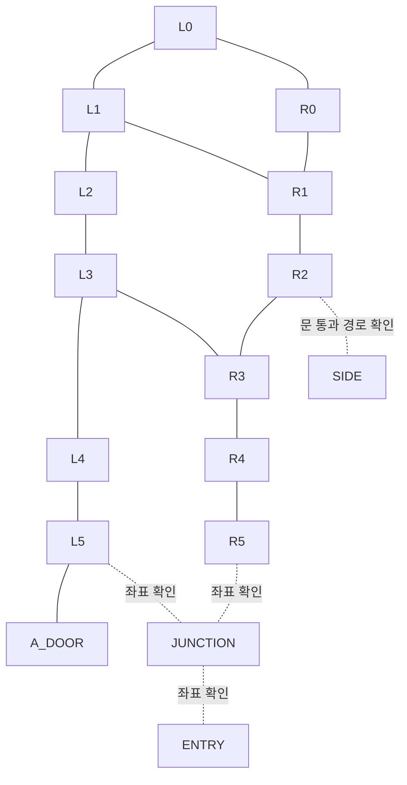

# OverworldScene 이동 지점과 시나리오 엔티티 위치

## 좌표와 근거

2026-09-09 작업 트리를 기준으로 작성했다. 이동 지점은 사용자가 제공한 `IMG_8207.jpeg`의 손그림을 옮겼으며, 장비와 스폰 위치는 저장소의 씬·프리팹·시나리오 그래프에서 확인했다. 손그림은 이동 참고 자료이며, 이 문서의 경로를 실제 플레이로 검증한 것은 아니다.

- 그림의 `(x, z)`는 Unity 월드 평면 좌표다. 실행 예제의 `[x, y, z]`에서 `y=0`은 평지 이동 목표의 기준 높이다. 장비의 설치 높이를 플레이어의 목표 높이로 사용하지 않는다.
- 그림은 **왼쪽이 +X, 오른쪽이 -X, 위쪽이 -Z, 아래쪽이 +Z**다. 실제 방위와 혼동하지 않도록 아래에서도 그림 기준으로 설명한다.
- 검은 점은 이동 참고점, 빨간 실선은 벽, 양끝 화살표가 달린 빨간 선은 문의 폭, 사각형 안 화살표는 침대 스냅 위치와 방향이다. 문 폭의 끝점은 이동 목표가 아니다.
- 아래 그래프의 간선은 손그림의 연결을 옮긴 경로 후보다. 벽·침대·카트·다른 플레이어의 충돌체를 피할 수 있는지는 실행 중에 확인한다. 거리만 가까운 두 노드를 임의로 직선 연결하지 않는다.

## Accessibles로 표시한 이동 가능 후보 범위

2026-09-10에 [OverworldSceneMarked.unity](../../../Assets/Scenes/OverworldSceneMarked.unity)의 `Accessibles` 아래 Cube 21개를 확인했다. 실제 오브젝트 이름은 모두 `Accessible`이므로 아래 표에서는 Transform fileID로 구분한다. 손그림의 점보다 이 범위를 우선 참고하되, 범위는 사용자가 대략 표시한 이동 가능 후보이며 충돌 검증 결과는 아니다.

모든 Cube와 부모 `Accessibles`(Transform `1925208590`)의 회전은 0이다. 부모 위치는 원점이고 스케일은 1이다. Unity 기본 Cube의 로컬 범위 `[-0.5,0.5]`에 Transform을 적용하여 `xMin = x - scaleX/2`, `xMax = x + scaleX/2` 및 Z 범위를 계산했다. Y는 포함 여부 판정에서 제외한다. 아래 구간은 양 끝을 포함하며, 전체 범위는 21개 직사각형의 합집합이다.

| Transform fileID | X 구간 | Z 구간 |
|---|---|---|
| `26836948` | `[-68.370, -62.230]` | `[-23.400, -19.200]` |
| `87883105` | `[-77.130, -67.990]` | `[-11.120, -4.620]` |
| `144578319` | `[-65.400, -59.260]` | `[-10.945, -7.015]` |
| `185721920` | `[-80.760, -64.460]` | `[-31.610, -30.610]` |
| `213115292` | `[-68.370, -62.230]` | `[-17.410, -13.210]` |
| `223542998` | `[-72.760, -68.560]` | `[-28.260, -27.260]` |
| `511601118` | `[-74.265, -68.435]` | `[-21.250, -20.250]` |
| `688605258` | `[-74.770, -68.370]` | `[-2.960, 3.540]` |
| `694454375` | `[-65.130, -61.370]` | `[-7.225, -5.695]` |
| `698072899` | `[-65.400, -59.260]` | `[-5.985, -5.055]` |
| `727016774` | `[-76.675, -68.545]` | `[-14.370, -13.370]` |
| `866414049` | `[-80.370, -76.630]` | `[-11.200, -9.280]` |
| `918341905` | `[-73.480, -71.980]` | `[-4.600, -1.620]` |
| `1153903977` | `[-77.360, -76.360]` | `[-30.910, -10.910]` |
| `1423174183` | `[-73.580, -72.580]` | `[-27.910, -13.910]` |
| `1492068711` | `[-81.770, -79.350]` | `[-26.395, -17.125]` |
| `1557864025` | `[-80.885, -77.115]` | `[-22.260, -21.260]` |
| `1585039220` | `[-68.880, -67.880]` | `[-30.910, -10.910]` |
| `1972154638` | `[-77.590, -73.390]` | `[-28.230, -27.230]` |
| `2020422505` | `[-85.385, -78.755]` | `[-12.220, -8.720]` |
| `2079446883` | `[-68.340, -64.840]` | `[-9.850, -8.850]` |

표는 소수점 셋째 자리까지 표시한다. 스크립트는 반올림하지 않은 씬 값을 사용하며 경계 비교에 `1e-9`의 수치 오차만 허용한다. 표시 영역 사이에 작은 틈이 있어도 임의로 메우지 않는다. 예를 들어 하단 넓은 영역의 Z 최대값은 `-4.62`, 좁은 연결 영역의 Z 최소값은 `-4.60`이므로 두 영역 사이에는 `0.02`의 미표시 구간이 있다. 이 구간에서 `false`가 나오는 것은 실제 통행 불가능 판정이 아니라 표시 범위 밖이라는 뜻이다.

### 좌표 검사 스크립트

[check_accessible.py](check_accessible.py)는 Python 3 표준 라이브러리만 사용하며, 실행할 때마다 씬을 읽는다. Cube를 수정하면 다음 실행부터 변경된 좌표를 사용한다. 기본 씬 경로는 스크립트 위치를 기준으로 계산하므로 실행 디렉터리에 의존하지 않는다.

저장소 루트에서 다음과 같이 실행한다. 입력은 Unity 월드 좌표의 **X와 Z 두 값**이다.

```sh
python3 Tools/unity-e2e/documentation/check_accessible.py -68 -20.95
python3 Tools/unity-e2e/documentation/check_accessible.py -72 -20
```

첫 번째 좌표는 범위 안이고 두 번째는 범위 밖이다. 출력은 한 줄 JSON이며, `inside`는 포함 여부, `matches`는 일치하는 모든 직사각형의 ID와 범위, `regionCount`는 읽은 영역 수다. 종료 코드는 범위 안이면 `0`, 범위 밖이면 `1`, 입력·씬 해석 오류이면 `2`다. 오류를 범위 밖 판정으로 취급하지 않는다. 다른 씬을 검사하려면 `--scene /absolute/path/to/scene.unity`를 사용한다.

스크립트는 `Accessibles` 아래의 기본 Cube 메시만 판정한다. 숨김·비활성 상태도 편집용 표식으로 취급해 포함하며, 중간 부모의 이동과 스케일을 적용한다. 회전된 Cube/부모나 다른 메시를 발견하면 잘못된 축 정렬 범위를 반환하지 않고 오류로 종료한다. 현재 씬의 일반 Transform 직렬화 구조를 대상으로 하며, 프리팹 인스턴스 형태로 표식을 바꿀 때는 판독 방식을 먼저 확장해야 한다.

### E2E 이동에 적용

이동 목표와 중간 경유점의 XZ를 먼저 검사한다. `inside: false`이면 인접 범위 안의 경유점을 찾거나 미표시 구간을 별도로 확인한다. 기존 손그림 경로도 검사 없이 그대로 사용하지 않는다. 예를 들어 `L0=(-68,-32)`는 현재 Cube 범위 밖이며, 위쪽 가로 통로는 Z `[-31.61,-30.61]`에 표시되어 있다.

시작점과 끝점이 모두 `inside: true`여도 두 점을 잇는 선분 전체가 합집합 안에 있다는 뜻은 아니다. 직사각형이 겹치는 구간을 경유하고, 긴 이동은 구간을 나누어 확인한다. 점 검사 모드는 선분 전체를 검사하지 않는다. 두 점 사이의 경로가 필요하면 아래 경로 탐색 모드를 사용한다. 플레이어 반경, 문 상태, 침대·카트·다른 플레이어는 실행 중에 별도로 관측해야 한다. 특히 가장자리의 점은 포함 판정이 나와도 플레이어 몸체가 장애물과 겹칠 수 있다.

### 두 좌표 사이의 경로 탐색

같은 스크립트에 `시작X 시작Z 도착X 도착Z` 네 값을 전달하면 직사각형 합집합을 벗어나지 않는 경로를 반환한다. 기존의 두 값 입력은 점 검사 모드로 유지한다.

```sh
python3 Tools/unity-e2e/documentation/check_accessible.py -68 -20.95 -76.86 -20.91
```

경로 모드는 `status`, `path`, `startInside`, `endInside`를 반환한다. `path`의 각 원소는 **`[x,z]`**이며 시작점과 도착점을 포함한다. 성공 시 `length`는 XZ 평면상의 경로 길이이고, `segmentRegionIds[i]`는 `path[i]`부터 `path[i+1]`까지 선분 전체를 포함하는 Cube의 Transform fileID다. 동일한 시작·도착 좌표는 점 하나와 길이 0을 반환한다.

- `status: ok`: 경로를 찾았다. 종료 코드는 `0`이다.
- `status: outside`: 시작점이나 도착점이 범위 밖이다. 각 `Inside` 필드로 어느 쪽인지 확인한다. 빈 경로와 종료 코드 `1`을 반환한다.
- `status: disconnected`: 두 점은 범위 안이지만 영역이 연결되지 않았다. 빈 경로와 종료 코드 `1`을 반환한다.
- 좌표 누락, 비유한 값, 씬 해석 실패는 오류이며 종료 코드는 `2`다.

직사각형마다 서로 겹치는 영역의 중심을 연결점으로 삼고, 같은 직사각형에 속한 점끼리 연결한 그래프에서 Dijkstra 탐색을 수행한다. 직사각형은 볼록하므로 각 연결 선분 전체가 해당 범위에 포함된다. 따라서 임의 간격으로 점을 샘플링하여 좁은 틈을 놓치는 방식이 아니다. 반환 경로는 이 그래프에서 가장 짧지만, 전체 공간에서 기하학적으로 가장 짧은 경로를 보장하지 않는다.

경로 모드는 미세한 틈도 연결하지 않도록 점 포함 여부와 겹침을 오차 확장 없이 판정한다. 경계에서 `1e-9`를 허용하는 기존 점 검사 모드와 극소수 좌표에서 결과가 다를 수 있다. 다음 두 점은 각각 범위 안이지만 그 사이에 앞서 기록한 0.02의 틈이 있어 `disconnected`를 반환한다.

```sh
python3 Tools/unity-e2e/documentation/check_accessible.py -72.73 -4.7 -72.73 -4.5
```

경계나 모서리만 맞닿는 직사각형도 수학적으로는 연결된 것으로 취급한다. 이 기능은 크기가 없는 점의 경로를 계산하므로 플레이어 몸체가 통과할 폭이나 동적 장애물까지 보장하지 않는다. E2E에서는 각 `[x,z]`를 `[x,이동 기준 높이,z]`로 변환해 순서대로 이동한다. 모서리에 도착하기 전에 다음 목표로 전환하면 계산된 선분을 벗어날 수 있으므로 도착 반경과 실제 이동 궤적도 확인한다. 반환 경유점을 임의로 생략하거나 직선으로 단축하지 않는다.

검증에는 L자 우회, 미세한 틈으로 분리된 영역, 모서리 접촉, 동일 좌표, 외부 좌표, 실제 씬의 우회 경로와 단절 구간을 포함했다. [test_check_accessible.py](test_check_accessible.py)는 다음 명령으로 실행한다.

```sh
PYTHONDONTWRITEBYTECODE=1 python3 -m unittest discover -s Tools/unity-e2e/documentation -p 'test_*.py'
```

## 손그림의 이동 그래프

### 노드와 벡터

`L`은 그림 왼쪽 통로, `R`은 오른쪽 통로다. `L4`와 `R4`는 서로 다른 Z값을 유지한다.

| ID | 평면 좌표 `(x, z)` | 용도 |
|---|---|---|
| L0 | (-68, -32) | 위쪽 왼쪽 모서리 |
| L1 | (-68, -28) | 위쪽 왼쪽 통로 |
| L2 | (-68, -26.25) | 왼쪽 통로의 중간 참고점 |
| L3 | (-68, -20.95) | 중앙 횡단 통로의 왼쪽 끝 |
| L4 | (-68, -15.5) | 아래쪽 왼쪽 통로 |
| L5 | (-68, -9.65) | 아래쪽 왼쪽 모서리 |
| R0 | (-76.3, -32) | 위쪽 오른쪽 모서리 |
| R1 | (-76.3, -28) | 위쪽 오른쪽 통로 |
| R2 | (-76.3, -22.5) | 오른쪽 문 앞 |
| R3 | (-76.3, -20.95) | 중앙 횡단 통로의 오른쪽 끝 |
| R4 | (-76.3, -13.8) | 아래쪽 오른쪽 통로 |
| R5 | (-76.3, -9.65) | 아래쪽 오른쪽 모서리; Z는 반대편 표기와 수평선을 기준으로 읽음 |
| A_DOOR | (-66.6, -9.65) | 왼쪽 아래 방의 문 앞 |
| SIDE | (-80, -18.3) | R2의 문을 지난 쪽에 표시된 목적지 |
| ENTRY | (-72.69, -4.2) | 그림 맨 아래 문의 중심 |
| JUNCTION | (-72.69, -4.2) | L5·R5와 ENTRY 사이의 분기점 |


### ASCII 배치도

점 사이의 `--`, `|`, `/`, `\`는 경로 후보이고 `###`는 벽이다. 도식은 비례도가 아니며, 좌표는 위 표를 따른다. `?`가 붙은 연결은 좌표 또는 통과 경로를 더 확인해야 한다.

```text
            +X <---                         ---> -X
                                 -Z
                                  ^
             L0 o-------------------------------o R0
                |       #################       |
             L1 o                               o R1
                |       #               #       |
             L2 o       #               #       |
                |       #               #       o R2 --?door?--> SIDE
  bed (-64,-23) v       #               #       |
             L3 o-------------------------------o R3
  bed (-64,-19.45) ^    #               #       |
  ############  |       #               #       |
  bed (-64,-17) v       #               #       |
             L4 o       #               #       o R4
  bed (-64,~ -13) ^     #               #       |
  ############  |       #################       |
 A room --?door?-o-------o L5                    o R5
             A_DOOR       \                     /
                           \--- JUNCTION -----/
                                   |
                                   ?
                         |<------ ENTRY ------>|
                          -71.72          -73.65
                                  v
                                 +Z
```

왼쪽 병상 쪽의 가로 벽 두 개는 서로 다른 구역을 나눈다. 벽을 사이에 둔 병상으로는 병상 좌표를 향해 대각선으로 이동하지 말고, 해당 구역의 통로를 통해 접근한다. 가운데 큰 구조물은 위·아래 외곽과 중앙 횡단 통로를 따라 우회한다.

### 그래프와 배열



`L1–R1`은 손그림의 수평 연결선에 근거한 후보다. 실제 통과 여부를 확인하기 전에는 상단 우회 `L1→L0→R0→R1`을 우선 고려한다. `L5–R5`의 직선 연결은 아래 구조물의 벽 때문에 추가하지 않았다.

다음 JSON은 문서용 자료다. `candidateEdges`는 양방향이며, 경로 탐색 시 필요하면 XZ 평면의 유클리드 거리를 가중치로 사용한다. `conditionalEdges`는 일반 경로 탐색에서 제외하고 현장에서 별도로 확인한다.

```json
{
  "coordinateOrder": ["x", "y", "z"],
  "points": {
    "L0": [-68, 0, -32], "L1": [-68, 0, -28],
    "L2": [-68, 0, -26.25], "L3": [-68, 0, -20.95],
    "L4": [-68, 0, -15.5], "L5": [-68, 0, -9.65],
    "R0": [-76.3, 0, -32], "R1": [-76.3, 0, -28],
    "R2": [-76.3, 0, -22.5], "R3": [-76.3, 0, -20.95],
    "R4": [-76.3, 0, -13.8], "R5": [-76.3, 0, -9.65],
    "A_DOOR": [-66.6, 0, -9.65], "SIDE": [-80, 0, -18.3],
    "ENTRY": [-72.69, 0, -4.2]
  },
  "candidateEdges": [
    ["L0", "L1"], ["L1", "L2"], ["L2", "L3"],
    ["L3", "L4"], ["L4", "L5"],
    ["R0", "R1"], ["R1", "R2"], ["R2", "R3"],
    ["R3", "R4"], ["R4", "R5"],
    ["L0", "R0"], ["L3", "R3"], ["L5", "A_DOOR"]
  ],
  "conditionalEdges": [["L1", "R1"], ["R2", "SIDE"]],
  "unresolvedEdges": [["L5", "JUNCTION"], ["R5", "JUNCTION"], ["JUNCTION", "ENTRY"]],
  "routeL5ToR2": [[-68, 0, -9.65], [-68, 0, -15.5], [-68, 0, -20.95], [-76.3, 0, -20.95], [-76.3, 0, -22.5]]
}
```

### 문과 침대 스냅 표기

| 대상 | 그림의 표기 | 테스트에서의 취급 |
|---|---|---|
| 아래 출입문 | X=-71.72부터 -73.65, Z=-4.2 | 폭 약 1.93. 끝점 대신 중앙을 통과한다. 기하학적 중점 X=-72.685는 필기의 -72.69와 부합한다. |
| 오른쪽 출입문 | R2=(-76.3,-22.5) 부근 | 정확한 폭·끝점은 미기재다. SIDE까지 직선 통과를 보장하지 않는다. |
| 왼쪽 아래 출입문 | A_DOOR=(-66.6,-9.65) 부근 | 정확한 폭·문 안쪽 목표는 미기재다. |
| 위 병상 | (-64,-23), 아래 화살표 | 그림의 +Z 방향이다. |
| 중앙 벽 위 병상 | (-64,-19.45), 위 화살표 | 그림의 -Z 방향이다. |
| 중앙 벽 아래 병상 | (-64,-17), 아래 화살표 | 그림의 +Z 방향이다. |
| 아래 벽 위 병상 | (-64,약 -13), 위 화살표 | Z의 소수부가 불명확하다. 정확한 스냅 좌표로 사용하지 않는다. |
| 왼쪽 아래 방 병상 | 오른쪽 화살표, 좌표 없음 | 그림의 -X 방향이다. 런타임 스냅 포인트를 조회한다. |

병상 화살표는 그림의 방향 표기다. 차량별 전방 축과 회전 보정이 있으므로 그대로 Unity yaw나 침대의 `positioningPoints` 값으로 환산하지 않는다.

## 컨트롤러가 있는 씬 장비

원본은 [OverworldScene.unity](../../../Assets/Scenes/OverworldScene.unity)다. 이름만 같은 장식 모델을 포함하지 않고 다음 프리팹의 컴포넌트를 확인했다.

- [Defibrillator.prefab](../../../Assets/Modules/TriageTrainer/Prefabs/Entities/MinecraftBoatLikes/Defibrillator.prefab): `DefibrillatorCartController`.
- [oxyflowmeter.prefab](../../../Assets/Modules/TriageTrainer/Prefabs/StaticAttachmentDisplayments/WallAttachedOxyflowmeter/oxyflowmeter.prefab): `WallAttachedOxyflowmeter`.
- [WallSuction.prefab](../../../Assets/Modules/TriageTrainer/Prefabs/StaticAttachmentDisplayments/WallAttachedWallSuction/WallSuction.prefab): `WallAttachedWallSuction`.

### 산소유량계와 벽 흡인기

아래는 컴포넌트의 `_entityIdentifier`와 장비 루트의 월드 위치다. 부모 Transform `428710769 → 1363733091 → 0`은 모두 항등 변환이므로 로컬 좌표와 월드 좌표가 같다.

| 엔티티 ID | 월드 `[x, y, z]` | 씬 PrefabInstance fileID | 접근 참고점 |
|---|---|---|---|
| `zone_0:oxyflowmeter` | `[-63.5619, 1.4, -12.3857]` | `726875868` | L4 → 구역 안쪽 |
| `zone_0:wall_suction` | `[-63.3856, 1.3178525, -12.4329]` | `542164185` | L4 → 구역 안쪽 |
| `zone_1:oxyflowmeter` | `[-63.4989, 1.4, -17.98275]` | `329463925` | L4 → 구역 안쪽 |
| `zone_1:wall_suction` | `[-63.2736, 1.3230035, -17.982748]` | `887807783` | L4 → 구역 안쪽 |
| `zone_2:oxyflowmeter` | `[-63.5619, 1.4, -18.35]` | `1392193129` | L3 → 구역 안쪽 |
| `zone_2:wall_suction` | `[-63.3856, 1.32, -18.35]` | `255303414` | L3 → 구역 안쪽 |
| `zone_3:oxyflowmeter` | `[-63.4896, 1.3968, -24.025]` | `127147856` | L2 또는 L3 → 구역 안쪽 |
| `zone_3:wall_suction` | `[-63.3279, 1.3613, -24.0117]` | `1507320861` | L2 또는 L3 → 구역 안쪽 |
| `zone_a:oxyflowmeter` | `[-58.792, 1.3513, -8.733]` | `1658321097` | L5 → A_DOOR → 방 안쪽 |
| `zone_a:wall_suction` | `[-58.8372, 1.2775, -8.9028]` | `1257785966` | L5 → A_DOOR → 방 안쪽 |

접근 참고점은 그림의 구역과 장비 위치를 비교한 후보다. 장비는 벽에 붙어 있으므로 마지막 이동은 통로에서 해당 벽의 올바른 쪽으로 접근한 뒤, 현재 상호작용 목록에 대상 ID가 나타나는지 확인한다. 특히 `zone_1`과 `zone_2`는 Z가 가깝지만 벽의 서로 다른 쪽에 있으므로 최근접 거리만으로 선택하지 않는다.

### 제세동기 카트

세 인스턴스 모두 `DefibrillatorCartController`를 상속한다. 아래 `scene-item:...`은 **StaticPlacedItem의 ID**이며 카트 컨트롤러의 ID와 구분해야 한다. 프리팹 컨트롤러의 직렬화 기본값은 세 대 모두 `defibrillator_cart_a`이고, 씬에서 그 필드를 덮어쓰지 않는다. 런타임 ID는 현재 관측한 차량/엔티티 목록에서 위치와 함께 확인한다.

| 씬 PrefabInstance fileID | StaticPlacedItem ID | 월드 `[x, y, z]` | 접근 참고 |
|---|---|---|---|
| `700468600` | `scene-item:overworld:Defibrillator:ae654d630dff2bebd47a4109f4c984f8` | `[-67.114815, 0.016, -11.97087]` | L4–L5 사이의 왼쪽 통로에서 접근한다. |
| `1518338904` | `scene-item:overworld:Defibrillator:e99bf01455c36f49a0c46bcfaa57b1c3` | `[-83.303, 0.016, -7.545]` | 그림 오른쪽 범위 밖이다. R5에서의 연결 경로는 미확인이다. |
| `1733840141041060502` | `scene-item:overworld:Defibrillator:4df5dd2b04f0def3e350491e7cf5ae3c` | `[-59.14905, 0.01182884, -4.49872]` (근삿값) | 그림 왼쪽 아래 방 쪽이다. A_DOOR 이후의 실내 경로를 확인한다. |

세 번째 인스턴스의 로컬 위치는 `[-75.826, 0, -96.508]`이다. 부모 `1488771648`의 위치 `[37.35895, 0.01182884, -80.32472]`, Y축 회전 90도, 단위 스케일을 적용하면 위 월드 좌표가 된다. 로컬 좌표를 이동 목표로 복사하지 않는다. 카트가 이동한 이후에는 이 초기 위치 대신 런타임 위치를 사용한다.

## 시나리오 그래프의 프리셋 스폰 위치

[TriageTrainer 시나리오 폴더](../../../Assets/Modules/TriageTrainer/Resources/Scenario)의 그래프를 조사했다. `EntityPresetSpawn` 노드가 있는 그래프는 다음 두 개다.

- [patient_a_critical.scenario.json](../../../Assets/Modules/TriageTrainer/Resources/Scenario/patient_a_critical.scenario.json)
- [patient_b_c_ct.scenario.json](../../../Assets/Modules/TriageTrainer/Resources/Scenario/patient_b_c_ct.scenario.json)

[ScenarioController.cs](../../../Assets/Modules/MultiplayerInfrastructure/Scripts/Scenario/ScenarioController.cs)의 `EntityPresetSpawn` 처리에서는 `positionSourceEntityIdentifier`를 해석할 수 있으면 그 위치가 노드의 숫자 좌표보다 우선한다. 일반 프리셋은 앵커 해석 실패 시 노드의 `positionX/Y/Z`를 사용하고, acting NPC는 자신의 정의에 있는 위치로 돌아간다. 따라서 B/C 그래프에 적힌 `[0,0,0]`을 정상 스폰 위치로 기록해서는 안 된다.

| 그래프 / 노드 | 프리셋 → 생성 엔티티 | 위치 앵커 ID | 앵커 월드 `[x, y, z]` | 앵커 Transform fileID |
|---|---|---|---|---|
| A / `SPAWN_A` | `patient_a` → `patient_a` | `scen_a:patient_spawnpoint_a` | `[-71.73906, 0.01, 0.07443]` | `1700442062` |
| B/C / `SPAWN_B` | `patient_b` → `patient_b` | `scen_b:patient_spawnpoint_b` | `[-74, 0, 2.3]` | `1034824261` |
| B/C / `SPAWN_C` | `patient_c` → `patient_c` | `scen_b:patient_spawnpoint_c` | `[-72, 0, 2.3]` | `1349757921` |
| B/C / `SPAWN_DUMMY` | `patient_dummy_d_b` → `patient_dummy_d_b` | `scen_b:patient_spawnpoint_dummy_d_a` | `[-70, 0, 2.3]` | `1426604186` |
| A / `SPAWN_DOCTOR` | `npc_doctor_preset` → `npc-doctor-patient-a-critical` | `scen_b:doctor_spawnpoint` | `[-83, 1, -32]` | `212607874` |
| B/C / `SPAWN_DOCTOR` | `npc_doctor_preset` → `npc-doctor-patient-b-c-ct` | `scen_b:doctor_spawnpoint` | `[-83, 1, -32]` | `212607874` |

모든 앵커는 항등 변환인 `1363733091`의 자식이다. 환자 네 종류의 스폰 회전은 `[0,-90,0]`이며, 의사 NPC는 `actingNpcs` 정의의 `[0,0,0]`을 사용한다. A도 의사 위치에 `scen_b:` 앵커를 참조하고, `patient_dummy_d_b`도 끝이 `dummy_d_a`인 앵커를 참조한다. 이름을 추측해 바꾸지 않는다.

A의 순서는 `SPAWN_A → SPAWN_DOCTOR → PRESET_A`다. B/C의 순서는 `SPAWN_B → SPAWN_C → SPAWN_DUMMY → ATTACH_SPAWNED_PATIENT_BEDS`이며, 이후 `SPAWN_DOCTOR → PRESET_B`로 이어진다. 표의 좌표는 최초 생성 위치이므로 침대 부착·운반 후의 환자 위치를 대신하지 않는다.

별도로 [tutorial.scenario.json](../../../Assets/Modules/TriageTrainer/Resources/Scenario/tutorial.scenario.json)은 `actingNpcs`의 `spawnOnStart: true`로 `npc_tutorial_hat` 프리셋을 `npc-tutorial-guide-hat` ID로 생성한다. 정의 위치는 `[76.4300003,0,21.6000004]`, 회전은 `[0,45,0]`이며 이 손그림 범위 밖이다. 두 의료 시나리오의 의사는 `spawnOnStart: false`이므로 위 노드 실행을 기다려야 한다.

환자 스폰 위치는 ENTRY보다 +Z 쪽이고 의사 스폰 위치는 R0보다 -X 쪽이다. 그 사이의 문·가구를 이 그림만으로 확정할 수 없으므로 그래프에 자동 연결하지 않는다.

## NPC의 주요 도착 위치와 최종 위치

다음은 시나리오에 정의된 이동이 완료되었을 때의 목표 위치다. 의사 이동은 `NPCControl`의 `mode: Control`로 실행된다. `destinationType: WaypointSet`은 씬의 `_waypoints` 배열 순서대로 이동하며, `Waypoint`는 지정한 앵커로 이동한다. 노드에 있는 `destinationX/Y/Z: 0`은 이 두 방식의 목적지가 아니다.

| NPC / 단계 | 이동 노드 또는 상태 | 목적지 | 씬 앵커 월드 `[x, y, z]` | 테스트에서의 의미 |
|---|---|---|---|---|
| B/C 의사 / 최종 처치 구역 | `MOVE_DOCTOR_TO_CARE_AREA` | `overworld:doctor-route:04` | `[-68, 1, -17.5]` | `P_B_C_CARE` 진입 전의 도착 위치이며, 그래프에 정의된 마지막 이동 목적지다. |
| A 의사 / 공통 경로 도착 | `MOVE_DOCTOR_TO_CARE_AREA_A` | `overworld:doctor-route:04` | `[-68, 1, -17.5]` | 처치실로 계속 이동하므로 최종 대기 위치로 판단하지 않는다. |
| A 의사 / 처치실 입구 | `MOVE_DOCTOR_TO_TREATROOM_ENTERANCE` | `scen_a:doctor_treatment_room_waypoint_enterance` | `[-68, 1, -10]` | L5 부근의 중간 도착점이다. 원본 ID의 `enterance` 철자를 유지한다. |
| A 의사 / 최종 처치실 내부 | `MOVE_DOCTOR_TO_TREATROOM_ENTERED` | `scen_a:doctor_treatment_room_waypoint_entered` | `[-61.5, 1, -10]` | 이후 `Q_WAIT_DOCTOR_REMOVE`로 진행한다. 도착 후 `facingYawDegrees: 0`을 적용한다. |
| 튜토리얼 안내 NPC / 유지 위치 | `NPC_TUT_REVEAL_HAT_NAME`은 `mode: Update` | `actingNpcs` 정의 위치 | `[76.4300003, 0, 21.6000004]` | 그래프에 이동 지시가 없다. 이름·표시 갱신 뒤에도 스폰 위치를 기준으로 찾는다. |

B/C 의사의 ID는 `npc-doctor-patient-b-c-ct`, A 의사의 ID는 `npc-doctor-patient-a-critical`, 안내 NPC의 ID는 `npc-tutorial-guide-hat`이다. B/C의 단계별 테스트 진입 경로에 있는 `SETUP_CARE_MOVE_DOCTOR`와 `SETUP_MOVE_PATIENTS_MOVE_DOCTOR`도 같은 `overworld:doctor-route`를 사용하되 `moveMode: Instant`로 처리하므로 마지막 목표는 동일하게 `[-68,1,-17.5]`다.

공통 이동 경로는 씬의 `WaypointSet` 컴포넌트 `1209274523`에서 다음 순서로 확인했다. 경로 부모 Transform `1209274522 → 1363733091 → 0`은 항등 변환이다.

| 순서 | 앵커 ID | 월드 `[x, y, z]` | Transform fileID |
|---|---|---|---|
| 01 | `overworld:doctor-route:01` | `[-83, 1, -32]` | `1516947578` |
| 02 | `overworld:doctor-route:02` | `[-77, 1, -32]` | `793346300` |
| 03 | `overworld:doctor-route:03` | `[-68, 1, -32]` | `1646271681` |
| 04 | `overworld:doctor-route:04` | `[-68, 1, -17.5]` | `856960787` |

처치실 입구와 내부 앵커의 Transform fileID는 각각 `517236051`, `1404434544`이며, 둘 다 항등 변환인 `1363733091`의 자식이다.

```text
spawn / route:01 (-83,-32)
  -> route:02 (-77,-32)
  -> route:03 (-68,-32) = L0
  -> route:04 (-68,-17.5)  [B/C final; between L3 and L4]
       -> entrance (-68,-10)  [A only; near L5]
       -> entered (-61.5,-10) [A final; facing yaw 0]
```

```json
{
  "doctorCommonRouteAnchors": [
    [-83, 1, -32], [-77, 1, -32], [-68, 1, -32], [-68, 1, -17.5]
  ],
  "doctorATreatmentRoomAnchors": [[-68, 1, -10], [-61.5, 1, -10]],
  "finalAnchorByNpc": {
    "npc-doctor-patient-b-c-ct": [-68, 1, -17.5],
    "npc-doctor-patient-a-critical": [-61.5, 1, -10],
    "npc-tutorial-guide-hat": [76.4300003, 0, 21.6000004]
  }
}
```

위 배열은 **NPC 목적지 앵커의 좌표**다. `MoveNpcRoutine`은 XZ 평면으로 이동하면서 현재 높이를 유지하거나 지면 검사로 Y를 보정하므로, 실제 NPC의 Y가 앵커의 `1`과 같다고 단정하지 않는다. 도착 검증에는 XZ 거리와 현재 NPC 관측값을 사용하고, A의 최종 방향은 별도로 확인한다. 세 NPC 모두 `despawnOnScenarioEnd: true`이므로 여기서 최종 위치는 시나리오 실행 중의 마지막 목표를 뜻하며, 종료 후에도 NPC가 남아 있다는 뜻은 아니다.

NPC 이동 코드는 NavMesh 경로 탐색 없이 Transform을 직접 이동시키고 지형지물을 통과할 수 있다. 따라서 이 배열을 플레이어의 무장애 보행 경로로 사용하지 않는다. B/C 의사에게는 L3–L4 통로에서 접근하고, A 의사에게는 L5와 A_DOOR를 거쳐 실제 문의 통과 가능 여부를 확인한 뒤 접근한다. 최종 상호작용 대상은 스폰 앵커가 아니라 현재 위치의 NPC ID로 조회한다. 이 추가 항목은 씬과 코드에서 대조했으며 실제 플레이 도착 검증은 수행하지 않았다.

## E2E에서 사용하는 순서

1. 현재 씬과 활성 시나리오를 확인하고, 필요한 스폰 노드가 실행되어 목표 엔티티가 존재하는지 관측한다.
2. 현재 위치에서 벽의 같은 쪽에 있는 통로 노드로 진입한다. 같은 구역인지 확인하지 않은 채 가장 가까운 노드를 선택하지 않는다.
3. 그래프의 확인 가능한 구간을 한 점씩 이동한다. 도착 반경이 너무 크면 모서리에 닿기 전에 다음 점으로 전환해 벽을 가로지를 수 있다. 기존 테스트의 `arrivalRadius: 0.6`을 시작값으로 삼고 현장에 맞게 조정한다.
4. 마지막 통로 노드에서 목표 엔티티의 최신 위치와 상호작용 가능 여부를 확인한다. 장비·환자 중심으로 파고들지 않도록 `targetOffset` 또는 대상 앞의 접근 좌표를 사용한다.
5. 정체되면 현재 좌표, 마지막 도착 노드, 목표 ID, 이동 억제 상태, 주변 침대·카트를 기록한다. 같은 직선 이동을 무한 반복하지 않는다. 다인 이동은 출발 간격을 두거나 서로 다른 통로 위치를 사용한다.

[기존 테스트](../test/live-patient-b-c-ct.ts)에서 사용하는 `runner.navigate` 형식에 맞춘 예제다. 현재 위치가 L5이고 다음 구간이 비어 있다는 전제다. `runner`, `instanceId`, `signal`은 테스트 실행 문맥에서 제공한다.

```typescript
const route: number[][] = [
  [-68, 0, -15.5],
  [-68, 0, -20.95],
  [-76.3, 0, -20.95],
  [-76.3, 0, -22.5],
];
for (const [index, targetPosition] of route.entries()) {
  await runner.navigate(instanceId, {
    id: `corridor_${index}`,
    type: 'navigate',
    target: `corridor_${index}`,
    mode: 'input_adapter',
    timeoutMs: 15000,
    args: { targetType: 'position', targetPosition, arrivalRadius: 0.6 },
  }, signal);
}
```
